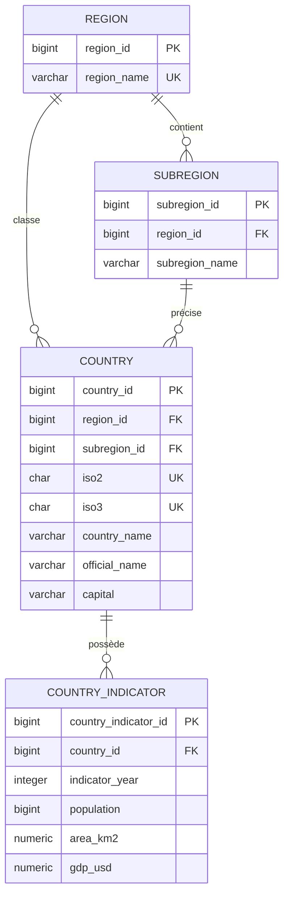

# MCD - Modèle conceptuel des données

## Cardinalités

- Une région contient zéro à plusieurs sous-régions.
- Une sous-région appartient à une et une seule région.
- Un pays peut être rattaché à une région et à une sous-région.
- Un pays possède zéro à plusieurs jeux d'indicateurs annuels.
- Un jeu d'indicateurs appartient à un seul pays.
